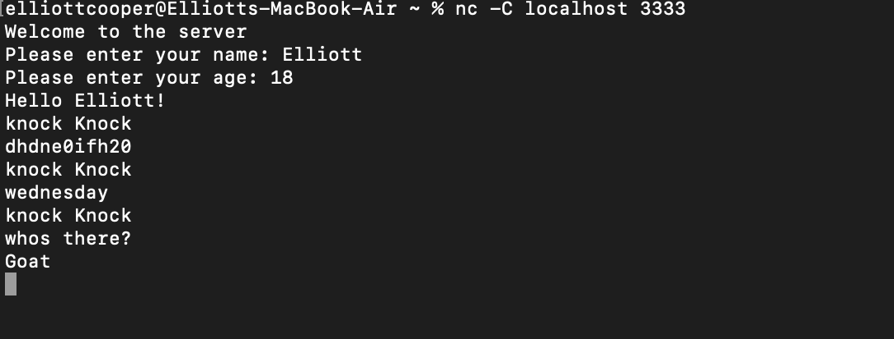

# TCP-Joke-Server 

A TCP server written in C, which uses the knock knock protocol. Demonstrates the Client-Server paradigm, by which the server sends out the joke, and the client can respond appropriately.

## Compiling

Compile with - `gcc -pedantic-errors -Wall -ansi -o server server.c`
  
Run with - `./server <port number>`

Or in one line -
`gcc -pedantic-errors -Wall -ansi -o server server.c && ./server <port number>`

`-pedantic-errors` -> Shows all strict warnings
  
`-Wall` -> Shows all warnings 
  
`-ansi` -> ansi C/ C99 language standard

To connect to the server on another machine/different terminal -
`nc -C <ip address of server> <port number>`

## How does it work?

Different parts of the joke are stored in 2D arrays, which can be indexed using an increment every time the loop passes.

The server takes the different parts of the jokes, and writes it to the client, and waits for a response before sending the next part.
  
Each time a joke has been completed, the server will ask the client if they want another one. If the client responds with 'yes' another will be sent, otherwise progam is terminated.
  
The server will only respond upon an accepted response -
  

  
## Interesting points

Dynamic memory allocation is used for the structure, and the name inside the structure. I decided to use this, as for the name, nobody knows how long a name will be. By using this, memory can be allocated from the heap, for whatever length of name the user decides to input (within reason).

The function `read_line_from_network()` is used to continually read from the network until all characters have been read. This is because only a specific number of bytes can be read at one time, and by using this function that I have written, it allows for all the data to be captured by the buffer.
  
 A structure is used to store some information about the user, name and age. If I was to expand on this in the future, age could be evaluated, and some adult jokes could be used, based on the age.
